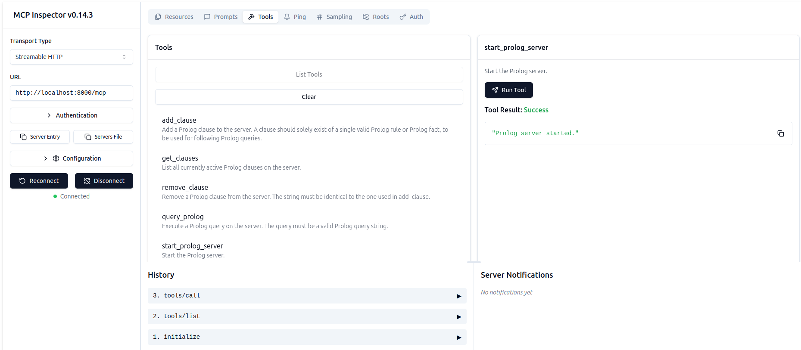

# Prolog MCP Server

A Model Context Protocol (MCP) server that enables direct integration between Large Language Models and SWI-Prolog. This server allows LLMs to define Prolog facts and rules (clauses) and to execute Prolog queries and leverage logical reasoning capabilities.


## Features

- Allow LLMs to add facts and rules (clauses) to SWI Prolog server
- Execute Prolog queries through MCP protocol
- Support for both HTTP and stdio transport
- Docker containerization support for the SWI Prolog server
- Implemented as python package for easy integration to agentic LLM applications
- **Compatible with MCP Inspector for interactive testing and debugging**


*Prolog MCP Server running in MCP Inspector showing available tools and interface*


## Prerequisites

- Python 3.8 or higher
- Git (for installation from source)
- Docker

## Installation on linux

1. Make sure git, python-venv and docker are installed, i.e.
Install git 
```bash
sudo apt install git python3.12-venv docker-buildx
```

2. Clone git repo
```bash
git clone https://github.com/wendelinism/prolog-mcp-server.git
```

Move into newly downloaded folder
```bash
cd prolog-mcp-server/
```

3. Create local python environment
```bash
python3 -m venv .
```
Activate local python environment
```bash
source bin/activate
```

4. Install python package prolog-mcp-server, and all it's python dependencies

```bash
pip install -e .
```

5. Build prolog docker image (without this the MCP-server will have no prolog server to connect to)


```bash
docker buildx build -t prolog-docker-image -f docker/prolog.dockerfile .
```
In case your user does not have permission yet to interact with docker, add local user to docker group:
```bash
sudo usermod -aG docker $USER
```
To make this change effective, restart the terminal session with
```bash
exec su - $USER
```
then go back to the project folder. Now you should be able to build the docker image.

## Installation on Windows and Mac
Should work on windows and Mac OS as well, but not tested yet.


## Usage

### Starting the Server

For HTTP transport setup, see the [HTTP transport implementation](examples/demo_prolog_MCP-server-start_http.py#L11-L22).

### Examples

Check the `examples/` directory for:
- HTTP transport demo
- Stdio transport demo  
- Client implementation examples

To start standalone Prolog MCP server with http server:
```bash
python3 examples/demo_prolog_MCP-server-start_http.py
```

### Test MCP-server with MCP inspector

To test a running MCP server with MCP inspector, first install npm:
```bash
sudo apt install npm -y
```
When MCP server is running with http transport, run in separate terminal:
```bash
fastmcp dev examples/demo_prolog_MCP-server-start_http.py
```

Follow link to MCP inspector with prefilled token.
In the web interface make sure to adjust transport type ("Streamable HTTP") and URL ("http://localhost:8000/mcp")
Hit connect, for test you should be able to go to "tools" now, and there "list tools"

## Docker Support

A Dockerfile is provided in the `docker/` directory for containerized deployment.

## License

MIT License - see LICENSE file for details.

## Contributing

Contributions are welcome. Feel free to submit issues and pull requests.

## Credits

This MCP server relies on [SWI-Prolog](https://www.swi-prolog.org/), an open-source Prolog implementation. All credits for the actual Prolog implementation go to the SWI-Prolog development team.

