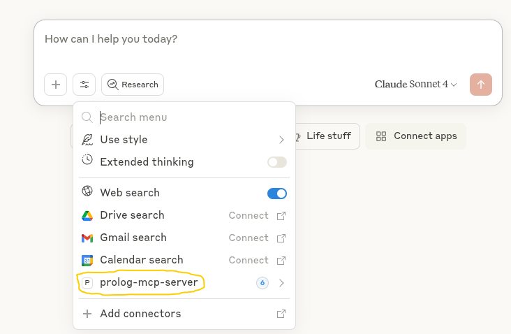
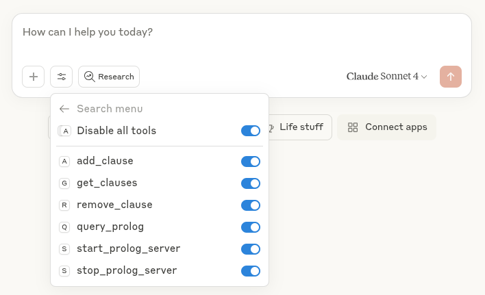

# Prolog MCP Server

A Model Context Protocol (MCP) server that enables direct integration between Large Language Models and SWI-Prolog. This server allows LLMs to define Prolog facts and rules (clauses) and to execute Prolog queries and leverage logical reasoning capabilities.


## Features

- Allow LLMs to add facts and rules (clauses) to SWI Prolog server
- Execute Prolog queries through MCP protocol
- Support for both HTTP and stdio transport
- Docker containerization support for the SWI Prolog server
- Implemented as python package for easy integration to agentic LLM applications
- **Compatible with MCP Inspector for interactive testing and debugging**


*Prolog MCP Server running in MCP Inspector showing available tools and interface*


## Prerequisites

- Python 3.8 or higher
- Git (for installation from source)
- Docker

## Installation on linux

1. Make sure git, python-venv and docker are installed, i.e.
Install git 
```bash
sudo apt install git python3.12-venv docker-buildx
```

2. Clone git repo
```bash
git clone https://github.com/wendelinism/prolog-mcp-server.git
```

Move into newly downloaded folder
```bash
cd prolog-mcp-server/
```

3. Create local python environment
```bash
python3 -m venv .
```
Activate local python environment
```bash
source bin/activate
```

4. Install python package prolog-mcp-server, and all it's python dependencies

```bash
pip install -e .
```

5. Build prolog docker image (without this the MCP-server will have no prolog server to connect to)


```bash
docker buildx build -t prolog-docker-image -f docker/prolog.dockerfile .
```
In case your user does not have permission yet to interact with docker, add local user to docker group:
```bash
sudo usermod -aG docker $USER
```
To make this change effective, restart the terminal session with
```bash
exec su - $USER
```
then go back to the project folder. Now you should be able to build the docker image.

## Installation on Windows and Mac
Should work on windows and Mac OS as well, but not tested yet.


## Usage

### Integration with Claude Desktop

*Claude Desktop with connector to Prolog-MCP-server*


*Claude Desktop can choose to use any of the tools shown for connected Prolog-MCP-server*

If [Claude Desktop](https://claude.ai/) is installed, the Prolog MCP server can be added to the Claude config, so that Claude can start a local instance of the server and run prolog code directly.
Preconditions: 
* Local clone of prolog-mcp-server repository (see above)
* Local python environment installed (see above)
* Docker prolog-docker-image built (see above)

#### Configuration

Add the following configuration to your `claude_desktop_config.json` file:

**Linux/Mac**: `~/.config/Claude/claude_desktop_config.json`  
**Windows**: `%APPDATA%\Claude\claude_desktop_config.json`

```json
{
  "mcpServers": {
    "prolog-mcp-server": {
      "command": "/path/to/python-env/bin/python",
      "args": [
        "/path/to/prolog-mcp-server/src/prolog_mcp_server.py",
        "--transport=stdio"
      ],
      "env": {
        "PATH": "/path/to/python-env/bin:/usr/local/bin:/usr/bin:/bin"
      }
    }
  }
}
```

> **Note**: Update both `/path/to/python-env/` and `/path/to/prolog-mcp-server/` to match your actual installation paths.

### Starting the Standalone Server with HTTP

For HTTP transport setup, see the the minimal example implemenation to start the standalone Prolg MCP server at [HTTP transport implementation](examples/demo_prolog_MCP-server-start_http.py#L11-L22).

### Examples for HTTP and stdio usage

Check the `examples/` directory for:
- [Demo Standalone Prolog MCP server using HTTP transport](examples/demo_prolog_MCP-server-start_http.py), detectable for MCP clients
- [Demo MCP client implementation with Prolog MCP server invoked, using stdio transport](examples/demo_MCP-client_invoking_Prolog-MCP-server_stdio.py), starting prolog, adding clauses, running query

To start standalone Prolog MCP server with http server:
```bash
python3 examples/demo_prolog_MCP-server-start_http.py
```

### Test MCP-server with MCP inspector

To test a running MCP server with MCP inspector, first install npm:
```bash
sudo apt install npm -y
```
When MCP server is running with http transport, run in separate terminal:
```bash
fastmcp dev examples/demo_prolog_MCP-server-start_http.py
```

Follow link to MCP inspector with prefilled token.
In the web interface make sure to adjust transport type ("Streamable HTTP") and URL ("http://localhost:8000/mcp")
Hit connect, for test you should be able to go to "tools" now, and there "list tools"

## Docker Support

A Dockerfile is provided in the `docker/` directory for containerized deployment.

## License

MIT License - see LICENSE file for details.

## Contributing

Contributions are welcome. Feel free to submit issues and pull requests.

## Credits

This MCP server relies on [SWI-Prolog](https://www.swi-prolog.org/), an open-source Prolog implementation. All credits for the actual Prolog implementation go to the SWI-Prolog development team.

